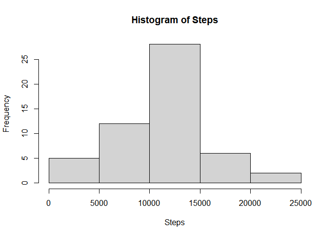
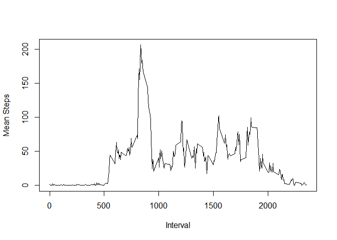
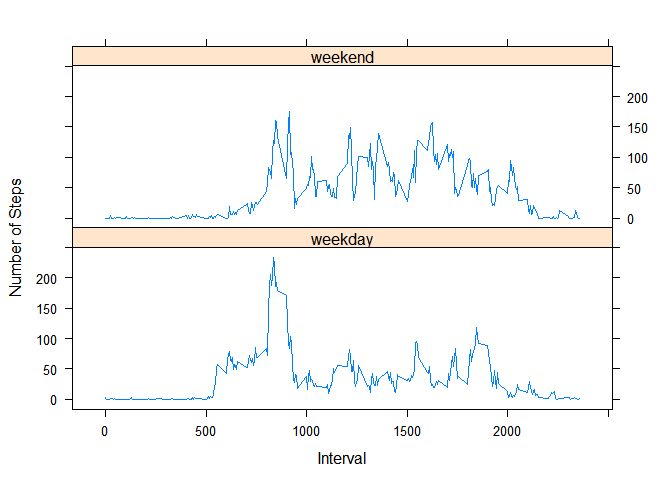

## Loading and preprocessing the data  
#### Assume Zip file is in the local directory  


```r
unzip('activity.zip')

activity <- read.csv('activity.csv')
```


## What is mean and media total number of steps taken per day?

```r
actGrp1 <- group_by(activity, date)

actSummaries1 <- summarize(actGrp1, steps=sum(steps))
```

```
## `summarise()` ungrouping output (override with `.groups` argument)
```

```r
hist(actSummaries1$steps, xlab="Steps", main="Histogram of Steps")
```

<!-- -->

```r
paste(mean(actSummaries1$steps, na.rm=TRUE), 'mean steps')  
```

```
## [1] "10766.1886792453 mean steps"
```

```r
paste(median(actSummaries1$steps, na.rm = TRUE), 'median steps')  
```

```
## [1] "10765 median steps"
```


## What is the average daily activity pattern?

```r
dailyActivity <- group_by(activity, interval)
intervalMeans <- summarize(dailyActivity, y=mean(steps, na.rm=TRUE))
```

```
## `summarise()` ungrouping output (override with `.groups` argument)
```

```r
plot(intervalMeans$interval, intervalMeans$y, type='l', xlab='Interval', ylab='Mean Steps')
```

<!-- -->

## Imputing missing values

```r
x <- is.na(activity$steps)

naVals <- sum(x)
paste('There are', naVals, 'rows with NA')
```

```
## [1] "There are 2304 rows with NA"
```

```r
#create new dataset to store new values for NA
#use the median for the time slot to replace NA
newAct <- activity
newActGrp <- group_by(newAct, interval)
newActSum <- summarize(newActGrp, vals=mean(steps, na.rm=TRUE))
```

```
## `summarise()` ungrouping output (override with `.groups` argument)
```

```r
#vector of indexes for rows with NA
naIdx <- which(is.na(newActGrp))
#loop through rows with NA, use the interval to find the mean calculated above
for(i in 1:length(naIdx)){
    iVal = newActGrp[naIdx[i], ]$interval
    m = newActSum[newActSum$interval == iVal, ]$vals
    newActGrp[naIdx[i],]$steps = round(m, digits = 0) #steps are integers, mean may be double
}
```

## Are there differences in activity patterns between weekdays and weekends?

```r
#regroup by date to get mean and median
newActGrp <- group_by(newActGrp, date)

newActSummaries <- summarize(newActGrp, steps=sum(steps))
```

```
## `summarise()` ungrouping output (override with `.groups` argument)
```

```r
#drop na.rm because NAs should be gone
paste(mean(newActSummaries$steps), 'mean steps')  
```

```
## [1] "10765.6393442623 mean steps"
```

```r
paste(median(newActSummaries$steps), 'median steps')  
```

```
## [1] "10762 median steps"
```


```r
activity <- ungroup(activity)
#mark dates if they are weekend or weekday
activity$weekend <- weekdays(as.Date(activity$date)) == 'Saturday' | weekdays(as.Date(activity$date)) == 'Sunday'
activity$weekend[activity$weekend == TRUE] = 'weekend'
activity$weekend[activity$weekend == FALSE] = 'weekday'
#group and summarize
actgroup <- group_by(activity, interval, weekend)
actsum <- summarize(actgroup, y=mean(steps, na.rm=TRUE))
```

```
## `summarise()` regrouping output by 'interval' (override with `.groups` argument)
```

```r
#plot
xyplot(y ~ interval | weekend, data = actsum, type = 'l', lty=1, lwd=1, layout = c(1:2), ylab='Number of Steps', xlab='Interval')
```

<!-- -->
